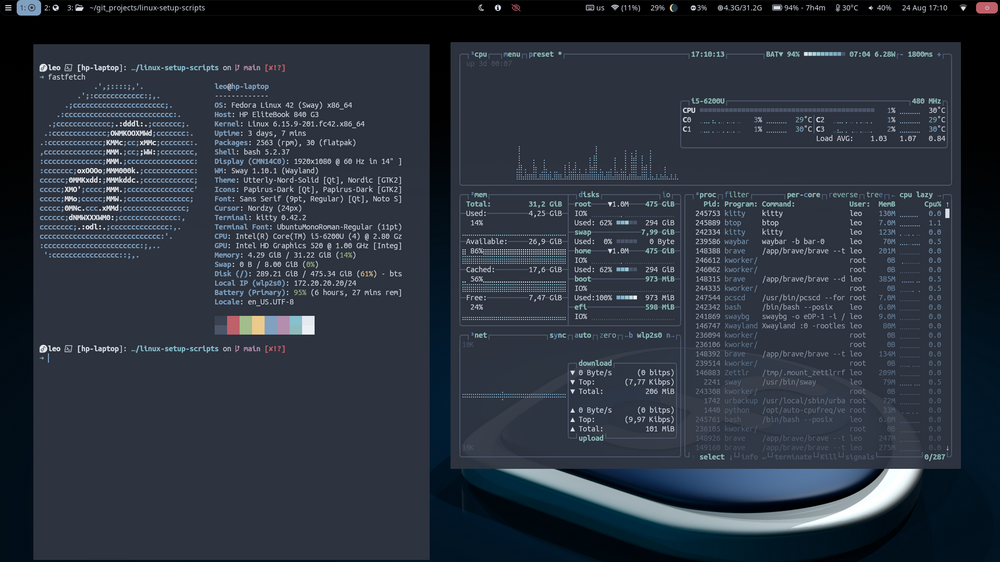
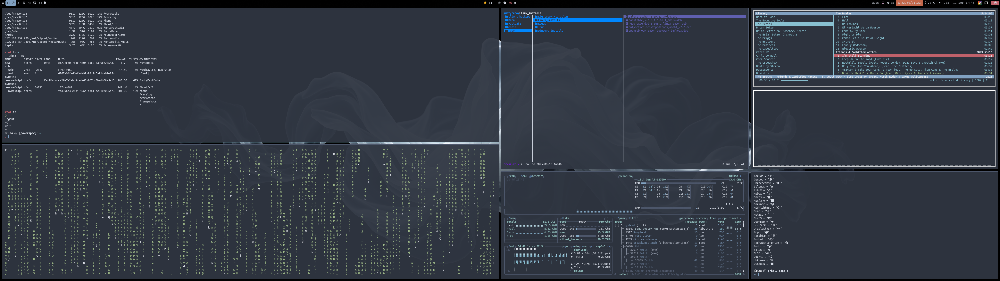

# Sway Setup

A clean, minimal, and practical Sway window manager setup for both **Debian (trixie)** and **Fedora**.  
This repo provides **setup scripts, instructions, and screenshots** to quickly reproduce my desktop environment.




---

## 🔗 Related Repositories

- 📂 [Dotfiles](https://github.com/leonzwrx/dotfiles) – all configuration files (Sway, Waybar, swayidle, swaylock, gtklock, etc.)  
- ⚙️ [Linux Setup Scripts](https://github.com/leonzwrx/linux-setup-scripts) – general post-install scripts, package installs, and utilities  

---

## 🙏 Inspiration & Credits

* **[Ubuntu Sway Remix](https://github.com/Ubuntu-Sway)** – Huge thanks for the inspiration and base ideas.
* **SwayWM, Waybar, and the wider Linux community** – for the incredible tools.
* Everyone sharing configs and scripts on GitHub and r/unixporn.

---

## 🖥️ Platforms

This setup works on both **Debian** and **Fedora**:

- **Debian (trixie)** – installed manually on top of a **minimal base system**.  
- **Fedora** – based on the official **Fedora Sway Spin**.  

⚠️ While installation steps differ, the **configs are identical**, so the look & feel remains consistent across both distros.

---

## 📂 Configurations

The actual configs live in my [dotfiles repo](https://github.com/leonzwrx/dotfiles).  
Here are the most relevant folders for this setup:

- [`.config/sway`](https://github.com/leonzwrx/dotfiles/tree/main/.config/sway)  
- [`.config/waybar`](https://github.com/leonzwrx/dotfiles/tree/main/.config/waybar)  
- [`.config/swayidle`](https://github.com/leonzwrx/dotfiles/tree/main/.config/swayidle)  
- [`.config/swaylock`](https://github.com/leonzwrx/dotfiles/tree/main/.config/swaylock)  
- [`.config/gtklock`](https://github.com/leonzwrx/dotfiles/tree/main/.config/gtklock)  

---

## Included Scripts:
* sway-install_debian.sh - Debian installer script
* sway-install_fedora.sh - Fedora installer script (on top of vanilla Fedora Sway Spin) UPDATE THE LINK
* nwg-wrapper_debian.sh - installs Wayland-friendly script output wrapper from source (Fedora should have these in official repos)
* [OPTIONAL] rofi-wayland_debian.sh - installs Wayland fork of Rofi from source on Debian. Standard rofi should now work in Wayland
* [OPTIONAL] sway-input-configurator_debian.sh - installs SWAY input manager for keyboards, touchpad, etc from source. Can be installed using pipx
* sway-systemd.sh - #installs sway-systemd, which allows easy systemd service integration for SWAY from source [UPDATE THE LINK]
* wttrbar.sh - installs wttr bar (for waybar) from source
* /resources - other files referenced by scripts

## 🚀 Installation

### 1. Clone this repo
```bash
git clone https://github.com/leonzwrx/sway-setup.git
cd sway-setup
```

### 2. Run setup script (choose your distro)

**Debian (trixie):**

```
./scripts/sway-install_debian.sh
```

**Fedora (Sway Spin):**

```
./scripts/sway-install_fedora.sh
```

### 3. Configure and customize [check link]
* [post-install-configs_sway.md](../post-install-configs_sway.md) - tasks and checklists after the install