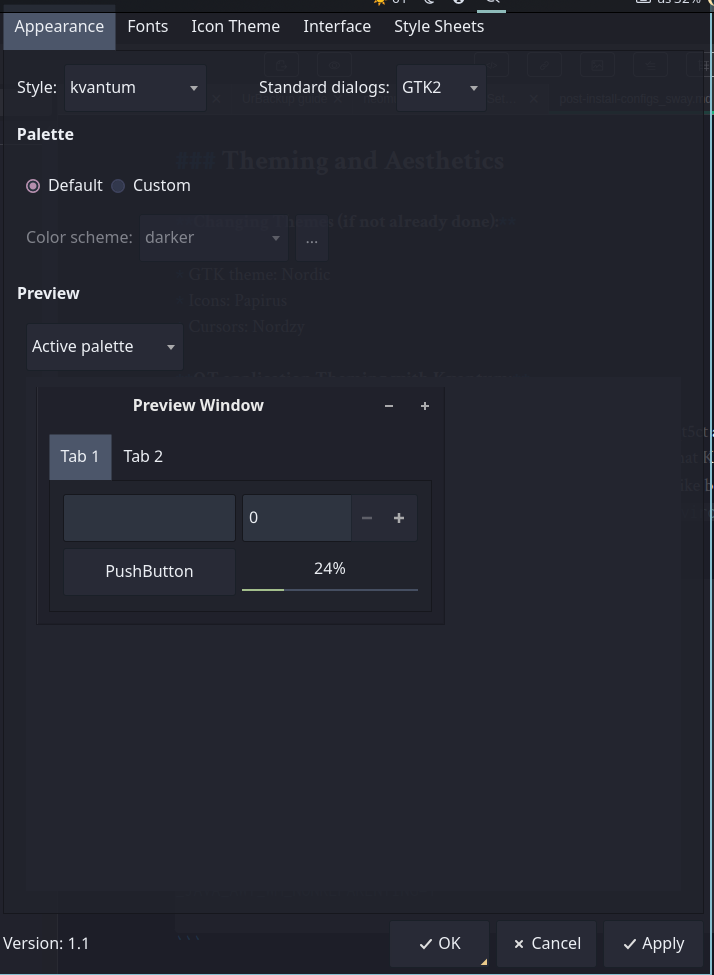
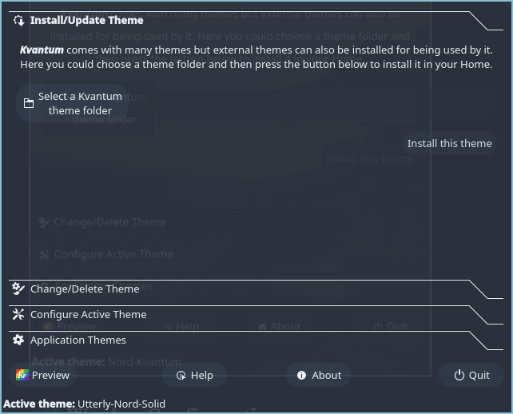

```bash
 _     _____ ___  _   _ _____
| |   | ____/ _ \| \ | |__  /
| |   |  _|| | | |  \| | / / 
| |___| |__| |_| | |\  |/ /_ 
|_____|_____\___/|_| \_/____|
                             
```                                                    

# 🪟 Sway Post-Install guide


_UPDATED September 2025_

This document is my basic checklist for configuring and customizing my SWAY WM on Debian stable and Fedora Sway Spin

### Verifying Functionality and Base Configuration

* Ensure all core Sway functions are running smoothly
	- Test with `swaymsg -r get_workspaces` 
* Verify `rofi` launches successfully (wofi or another launcher can serve as a backup).
* Go through user services by reviewing `systemctl --user list-unit-files` and enable any services that might need to be enabled such as  `foot-server.servier` and `waybar.service`
* Check if installed fonts (Nerd Fonts/glyphs) work as expected in Waybar and other applications.
* Review `nwg-displays` configuration and verify resolution settings.
* Confirm Sway scripts for autotiling, volume control, workspace switching, etc. are working properly
* By default, the sway.desktop file simply launches`sway`. 
	- However, it's best to copy start-sway (both located in the resources directory) into `/usr/bin` and modify `sway.desktop` file:
```bash
	[Desktop Entry]
	Name=Sway
	Comment=An i3-compatible Wayland compositor
	Exec=start-sway
	Type=Application
```
`start-sway` is a bash script that provides additional systemd integration including `journalctl` logging (`journalctl /usr/bin/sway`)	

### Theming and Aesthetics

**Changing Themes (if not already done):**

* GTK theme: Nordic
* Icons: Papirus-Dark
* Cursors: Nordzy

**QT application Theming with Kvantum:**

* Both Qt5ct and Qt6ct should be set to have style set to _kvantum_ so that Kvantum manager application can be used to customize look of the Kvantum style
* Kvantum Manager is the config tool for the Kvantum style as long as both Qt5ct/Qt6ct's style is set to _kvantum_.
* Qt5ct and Qt6ct manage fonts, icons, and other settings independently, both need to be set).
* Recommended way is to set the enviroment variable to just `qt5ct` like below since Qt6 applications should be smart enough to look for their own qt6ct settings
* Make sure environtal variables are added to a drop-in file in`/etc/environment.d` similar to 

```
QT_QPA_PLATFORMTHEME=qt5ct
QT_QPA_PLATFORM="wayland;xcb"

# Set default cursor size
XCURSOR_SIZE=24

# Force Wayland for EFL (Enlightenment) apps
ECORE_EVAS_ENGINE="wayland-egl"
ELM_ACCEL="gl"

# Java XWayland blank screens fix
_JAVA_AWT_WM_NONREPARENTING=1

```

Qt5ct:



Kvantum Manager:



### Waybar Configuration

* Double-check all Waybar icons for appearance and functionality. Ensure variables in config files are set correctly and nothing is missing.
* Verify alignment and borders are configured as desired

### Issues to troubleshoot:

### Additional Verifications
* Review keyboard/input settings.
* Confirm power menu functionality (nwg-bar).
* Verify systemd user services in `~/.config/systemd/user` are present, enabled, and working (especially `waybar.service`). You might need to copy them manually from resources if desired.
* Ensure notifications and screenshots work as expected.
